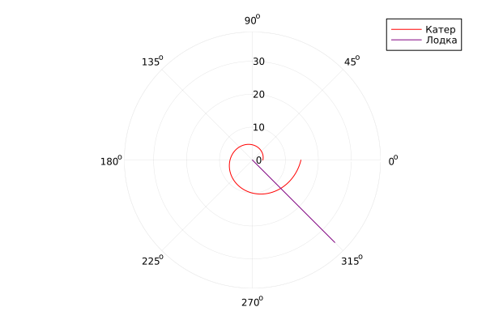
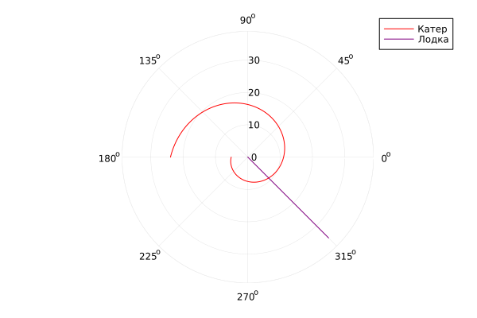

---
## Front matter
title: "Отчёт по лабораторной работе №2"
subtitle: "Задача о Погоне, вариант №45"
author: "Танрибергенов Эльдар"

## Generic options
lang: ru-RU
toc-title: "Содержание"

## Bibliography
bibliography: bib/cite.bib
csl: pandoc/csl/gost-r-7-0-5-2008-numeric.csl

## Pdf output format
toc: true # Table of contents
toc-depth: 2
lof: true # List of figures
lot: true # List of tables
fontsize: 12pt
linestretch: 1.5
papersize: a4
documentclass: scrreprt
## I18n polyglossia
polyglossia-lang:
  name: russian
  options:
	- spelling=modern
	- babelshorthands=true
polyglossia-otherlangs:
  name: english
## I18n babel
babel-lang: russian
babel-otherlangs: english
## Fonts
mainfont: PT Serif
romanfont: PT Serif
sansfont: PT Sans
monofont: PT Mono
mainfontoptions: Ligatures=TeX
romanfontoptions: Ligatures=TeX
sansfontoptions: Ligatures=TeX,Scale=MatchLowercase
monofontoptions: Scale=MatchLowercase,Scale=0.9
## Biblatex
biblatex: true
biblio-style: "gost-numeric"
biblatexoptions:
  - parentracker=true
  - backend=biber
  - hyperref=auto
  - language=auto
  - autolang=other*
  - citestyle=gost-numeric
## Pandoc-crossref LaTeX customization
figureTitle: "Рис."
tableTitle: "Таблица"
listingTitle: "Листинг"
lofTitle: "Список иллюстраций"
lotTitle: "Список таблиц"
lolTitle: "Листинги"
## Misc options
indent: true
header-includes:
  - \usepackage{indentfirst}
  - \usepackage{float} # keep figures where there are in the text
  - \floatplacement{figure}{H} # keep figures where there are in the text
---

# Цель работы

Приведем один из примеров построения математических моделей для выбора правильной стратегии при решении задач поиска. 
Например, рассмотрим задачу преследования браконьеров береговой охраной. 
На море в тумане катер береговой охраны преследует лодку браконьеров. Через определенный промежуток времени туман рассеивается, 
и лодка обнаруживается на расстоянии k км от катера. Затем лодка снова скрывается в тумане и уходит прямолинейно в неизвестном направлении. 
Известно, что скорость катера в n раза больше скорости браконьерской лодки. 
Необходимо определить по какой траектории необходимо двигаться катеру, чтоб нагнать лодку.

# Задание
На море в тумане катер береговой охраны преследует лодку браконьеров.
Через определенный промежуток времени туман рассеивается, и лодка обнаруживается на расстоянии 16,4 км от катера. 
Затем лодка снова скрывается в тумане и уходит прямолинейно в неизвестном направлении. 
Известно, что скорость катера в 4,2 раза больше скорости браконьерской лодки
1. Запишите уравнение, описывающее движение катера, с начальными условиями для двух случаев.
2. Постройте траекторию движения катера и лодки для двух случаев.
3. Найдите точку пересечения траектории катера и лодки.

# Выполнение лабораторной работы

## Решение
Принимаем за $t_0=0, X_0=0$ - место нахождения лодки браконьеров в момент обнаружения, $x_0=k$ - место нахождения катера береговой охраны
относительно лодки браконьеров в момент обнаружения лодки.

Введём полярные координаты. Считаем, что полюс - это точка обнаружения лодки браконьеров $x_0=0 (\theta=x_0=0)$, а полярная ось $r$ проходит 
через точку нахождения катера береговой охраны.

Чтобы найти расстояние $x$ (расстояние после которого катер начнёт двигаться вокруг полюса), необходимо составить простое уравнение. 
Пусть через время $t$ катер и лодка окажутся на одном расстоянии $x$ от полюса.
За это время лодка пройдет x, а катер $k-x$ (или $k+x$, в зависимости от начального положения катера относительно полюса). Время, за которое они
пройдут это расстояние, вычисляется как $\frac{x}{v}$ или $\frac{k+x}{nv}$  (во втором случае  $frac{k-x}{nv}$), где $n=4,2$. 
Так как время одно и то же, то эти величины одинаковы. Тогда неизвестное расстояние x можно найти из следующего уравнения:
$\frac{x}{v}=\frac{x+k}{nv}$ - в первом случае, $\frac{x}{v}=\frac{x-k}{nv}$ во втором. 

Отсюда мы найдем два значения $x_1$ и $x_2$, задачу будем решать для двух случаев.
 
$x_1=\frac{k}{n+1}$,  при $\theta=0$  и  $x_2=\frac{k}{n-1}$,  при $\theta=-\pi$ 

После того, как катер береговой охраны окажется на одном расстоянии от полюса, что и лодка, он должен сменить прямолинейную траекторию и
начать двигаться вокруг полюса удаляясь от него со скоростью лодки $v$. Для этого скорость катера раскладываем на две составляющие: 
$v_r$ - радиальная скорость  и  $v_t$ - тангенциальная. Радиальная скорость - это скорость, с которой катер удаляется от полюса $v_r = \frac{dr}{dt}$. 
Нам нужно, чтобы эта скорость была равна скорости лодки, поэтому полагаем $\frac{dr}{dt} = v$.
Тангенциальная скорость – это линейная скорость вращения катера относительно полюса. Она равна произведению угловой скорости $\frac{d\theta}{dt}$ 
на радиус $r$, $v_r = r\frac{d\theta}{dt}$. Вектора образуют прямоугольный треугольник, откуда по теореме Пифагора можно найти
тангенциальную скорость $v_t = \sqrt{n^2 v_r^2 - v^2}$. Поскольку радиальная скорость равна $v$, тангенциальную скорость находим из уравнения $v_t = \sqrt{n^2 v^2 - v^2}$.
Следовательно, $v_t = v\sqrt{n^2-1}$.

Тогда получаем $r\frac{d\theta}{dt} = v\sqrt{n^2-1}$.

Решение исходной задачи сводится к решению системы из двух дифференциальных уравнений.

## Программа на языке Julia
```

#подключение модулей
using Plots
using DifferentialEquations

n = 4.2 #разница в скорости 
k = 16.4 #начальное расстояние от лодки до катера

#условия 1-го случая
r0_1 = k/(n+1)
theta0_1 = 0
T_1 = collect(LinRange(theta0_1, 2*pi, 1000))

#условия 2-го случая
r0_2 = k/(n-1)
theta0_2 = -pi
T_2 = collect(LinRange(theta0_2, pi, 1000))

t = collect(LinRange(0.0001, 25, 1000))

#функция, описывающая движение катера береговой охраны 
function f1(r,p,t)
return r/sqrt(n^2-1)
end

#функция, описывающая движение лодки браконьеров
function f2(t)
return tan(3/4*pi)*t
end

#моделирование движения лодки браконьеров
r1=[]
theta1=[]
for i in t
push!(r1, sqrt(i^2 + f2(i)^2))
push!(theta1, atan(f2(i)/i))
end

#решение 1-го случая
problem1 = ODEProblem(f1, r0_1, (theta0_1, 2*pi))
solution1 = solve(problem1, saveat=T_1)

#решение 2-го случая
problem2 = ODEProblem(f1, r0_2, (theta0_2, pi))
solution2 = solve(problem2, saveat=T_2)

#график в 1 случае
plot(solution1, proj=:polar, color=:red, label="Катер")
plot!(theta1, r1, proj=:polar, color=:purple, label="Лодка")

#сохранение графика
savefig("C:\\work\\study\\2022-2023\\Математическое_моделирование\\mathmod\\LabWorks\\LW2\\report\\images\\L2_jl_01.png")

#график в 2 случае
plot(solution2, proj=:polar, color=:red, label="Катер")
plot!(theta1, r1, proj=:polar, color=:purple, label="Лодка")

#сохранение графика
savefig("C:\\work\\study\\2022-2023\\Математическое_моделирование\\mathmod\\LabWorks\\LW2\\report\\images\\L2_jl_02.png")

```
## Результаты

{ #fig:001 width=70% height=70% }

Точка пересечения катера и лодки, исходя из графика, имеет приблизительные координаты

$$
 \begin{cases}
   \theta=315
   \\
	r=12
 \end{cases}
\
$$

{ #fig:002 width=70% height=70% }

Точка пересечения катера и лодки, исходя из графика, имеет приблизительные координаты

$$
 \begin{cases}
   \theta=315
   \\
	r=9
 \end{cases}
\
$$


# Выводы

Я рассмотрел задачу о погоне, провели анализ и вывод дифференциальных уравнений, смоделировали ситуацию, нашел точки пересечения катера и лодки.


