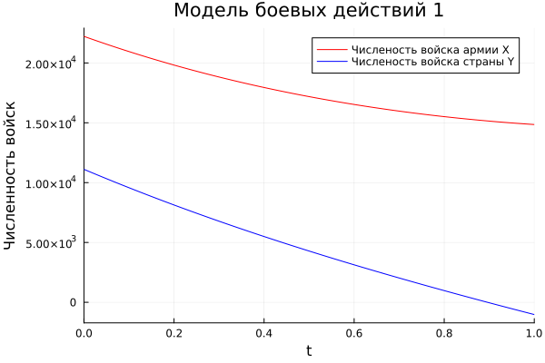
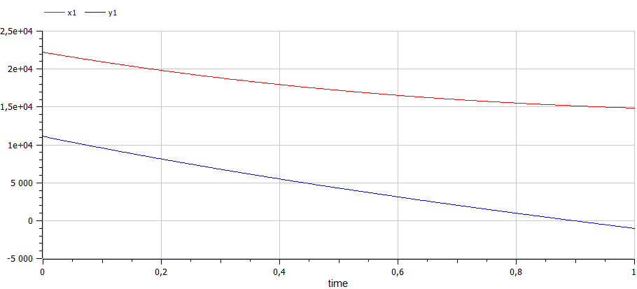
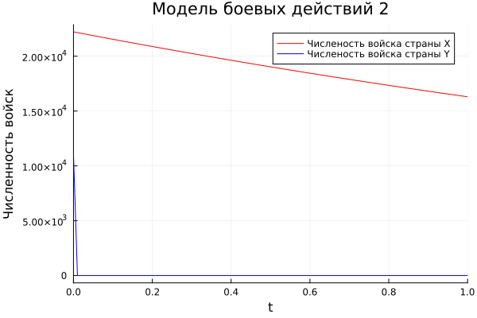
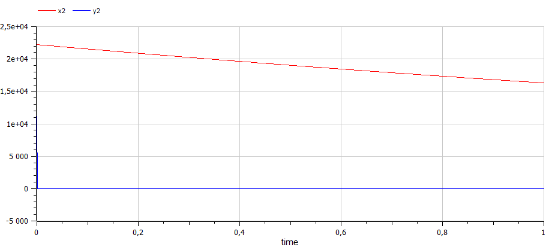

---
## Front matter
lang: ru-RU
title: Презентация лабораторной работы №3
subtitle: Модель боевых действий
author:
  - Танрибергенов Эльдар
institute:
  - Российский университет дружбы народов, Москва, Россия
date: 2023 г.

## i18n babel
babel-lang: russian
babel-otherlangs: english

## Formatting pdf
toc: false
toc-title: Содержание
slide_level: 2
aspectratio: 169
section-titles: true
theme: metropolis
header-includes:
 - \metroset{progressbar=frametitle,sectionpage=progressbar,numbering=fraction}
 - '\makeatletter'
 - '\beamer@ignorenonframefalse'
 - '\makeatother'
---

# Цели и задачи работы

## Цель лабораторной работы

Рассмотрим некоторые простейшие модели боевых действий – модели
Ланчестера. В противоборстве могут принимать участие как регулярные войска,
так и партизанские отряды. В общем случае главной характеристикой соперников
являются численности сторон. Если в какой-то момент времени одна из
численностей обращается в нуль, то данная сторона считается проигравшей (при
условии, что численность другой стороны в данный момент положительна).

## Задание к лабораторной работе

1. Изучить теоритическую информацию о моделях боев с участием регулярных войск и с дополнительным участием партизанских отрядов.
2. Построить траекторию изменения численности ввойск при двух случаях. 
3. Определить по графикам страну победитель.

# Процесс выполнения лабораторной работы

## Теоретический материал 

Рассмотрим три случая ведения боевых действий: 
1. Боевые действия между регулярными войсками 
2. Боевые действия с участием регулярных войск и партизанских отрядов 
3. Боевые действия между партизанскими отрядами 

В первом случае численность регулярных войск определяется тремя факторами:

1. скорость уменьшения численности войск из-за причин, не связанных с боевыми действиями (болезни, травмы, дезертирство);
2. скорость потерь, обусловленных боевыми действиями противоборствующих сторон (что связанно с качеством стратегии, уровнем вооружения, профессионализмом солдат и т.п.);
3. скорость поступления подкрепления (задаётся некоторой функцией от времени). 

## Теоретический материал 

В этом случае модель боевых действий между регулярными войсками описывается следующим образом

$$
 \begin{cases}
	\frac{dx}{dt}= -a(t)x(t) - b(t)y(t) + P(t)
	\\   
	\frac{dy}{dt}= -c(t)x(t) - h(t)y(t) + Q(t)
 \end{cases}
$$

Потери, не связанные с боевыми действиями, описывают члены $–a(t)x(t)$ и $–h(t)y(t)$, члены $–b(t)y(t)$ и $–c(t)x(t)$ отражают потери на поле боя. Коэффициенты $b(t)$, $c(t)$ указывают на эффективность боевых действий со стороны $y$ и $x$ соответственно, $a(t)$,$h(t)$  - величины, характеризующие степень влияния различных факторов на потери. Функции $P(t)$,$Q(t)$  учитывают возможность подхода подкрепления к войскам $X$ и $Y$ в течение одного дня. 

## Теоретический материал 

Во втором случае в борьбу добавляются партизанские отряды. Нерегулярные войска в отличии от постоянной армии менее уязвимы, так как действуют скрытно, в этом случае сопернику приходится действовать неизбирательно, по площадям, занимаемым партизанами. Поэтому считается, что темп потерь партизан, проводящих свои операции в разных местах на некоторой известной территории, пропорционален не только численности армейских соединений, но и численности самих партизан. В результате модель принимает вид:

$$
 \begin{cases}
	\frac{dx}{dt}= -a(t)x(t) - b(t)y(t) + P(t)
	\\   
	\frac{dy}{dt}= -c(t)x(t)y(t) - h(t)y(t) + Q(t)
 \end{cases}
$$

## Теоретический материал 

Модель ведение боевых действий между партизанскими отрядами с учетом предположений, сделанном в предыдущем случаем, имеет вид:

$$
 \begin{cases}
	\frac{dx}{dt}= -a(t)x(t) - b(t)x(t)y(t) + P(t)
	\\   
	\frac{dy}{dt}= -h(t)y(t) - c(t)x(t)y(t) + Q(t)
 \end{cases}
$$

## Условие задачи

Между страной Х и страной У идет война. Численность состава войск
исчисляется от начала войны, и являются временными функциями
x(t) и y(t). В начальный момент времени страна Х имеет армию численностью 22 222 человек,
а в распоряжении страны У армия численностью в 11 111 человек. Для упрощения модели считаем, 
что коэффициенты a, b, c, h постоянны. Также считаем P(t) и Q(t)
непрерывные функции. Постройте графики изменения численности войск армии Х и армии У для
следующих случаев:

## Первая модель

1. Модель боевых действий между регулярными войсками

$$
 \begin{cases}
	\frac{dx}{dt}= -0.22x(t) - 0.77y(t) + sin(0.5*t)+2
	\\   
	\frac{dy}{dt}= -0.66x(t) - 0.11y(t) + cos(0.5*t)+2
 \end{cases}
$$

## Вторая модель

2. Модель ведение боевых действий с участием регулярных войск и
партизанских отрядов

$$
 \begin{cases}
	\frac{dx}{dt}= -0.31x(t) - 0.79y(t) + sin(2.5*t)+1
	\\   
	\frac{dy}{dt}= -0.59x(t)y(t) - 0.21y(t) + cos(2*t)+2
 \end{cases}
$$

## Результаты

{ #fig:001 width=70% height=70% }.

Побеждает страна $X$.

## Результаты

{ #fig:002 width=70% height=70% }.

Побеждает страна $X$.

## Результаты

{ #fig:003 width=70% height=70% }.

Побеждает страна $X$.

## Результаты

{ #fig:004 width=70% height=70% }.

Побеждает страна $X$.

# Выводы по проделанной работе

В результате проделанной лабораторной работы мы познакомились с моделью «Боевые действия». 
Проверили, как работает модель в ситуациях с участием только регулярных войск и с участием также партизанских отрядов,
построили графики $y(t)$ и $x(t)$ в рассматриваемых случаях.

