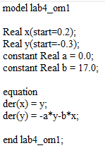

---
## Front matter
lang: ru-RU
title: Лабораторная работа №4
subtitle: Модель гармонических колебаний
author:
  - Танрибергенов Эльдар.
institute:
  - Российский университет дружбы народов, Москва, Россия
date: 2023 г.

## i18n babel
babel-lang: russian
babel-otherlangs: english

## Formatting pdf
toc: false
toc-title: Содержание
slide_level: 2
aspectratio: 169
section-titles: true
theme: metropolis
header-includes:
 - \metroset{progressbar=frametitle,sectionpage=progressbar,numbering=fraction}
 - '\makeatletter'
 - '\beamer@ignorenonframefalse'
 - '\makeatother'
---

## Цели и задачи

Рассмотреть модель гармонических колебаний - линейный гармонических осциллятор. 

Построить фазовый портрет гармонического осциллятора и решение уравнения
гармонического осциллятора для следующих случаев:

1. Колебания гармонического осциллятора без затуханий и без действий внешней
силы $\ddot x + 17x = 0$

2. Колебания гармонического осциллятора c затуханием и без действий внешней
силы $\ddot x + 22 \dot x +23x= 0$

3. Колебания гармонического осциллятора c затуханием и под действием внешней
силы $\ddot x + 5 \dot x +8x= 0.25\sin(8t)$

На интервале $t \in [0; 58]$ (шаг 0.05) с начальными условиями $x_0 = 0.2$, $y_0=-0.3$.

## Материалы и методы

- Julia
- OpenModelica

# Выполнение работы

## Изучение теории

В общем виде наши уравнения это однородные ОДУ 2-го порядка (линейные):

   $$
   \ddot x(t) + a\dot x(t) + bx(t) = F(t)
   $$ 

   где $\dot x = \frac{dx}{dt}$ - производная по времени.

   Тогда система для решения:

   $$
   \begin{cases}
     \frac{dx}{dt} = y
     \\
     \frac{dy}{dt} = F(t) -ay - bx
   \end{cases}
   $$ 

## Первый случай

Колебания гармонического осциллятора без затуханий и без действий внешней силы $\ddot x + 17x = 0$. 

Система для решения первого случая

    $$
   \begin{cases}
     \dot x = y
     \\
     \dot y = -17x
   \end{cases}
   $$

## Написание кода (1-й случай)

 Код на Julia

## Результаты, полученные из Julia

:::::::::::::: {.columns align=center}
::: {.column width="50%"}

:::
::: {.column width="50%"}

:::
::::::::::::::

## Написание кода (1-й случай)

 Код на OpenModelica

## Результаты, полученные из OpenModelica

:::::::::::::: {.columns align=center}
::: {.column width="50%"}

:::
::: {.column width="50%"}

:::
::::::::::::::

## Второй случай

Колебания гармонического осциллятора c затуханием и без действий внешней силы $\ddot x + 22 \dot x +23x= 0$. 

Система для решения второго случая

    $$
   \begin{cases}
     \dot x = y
     \\
     \dot y = -22y - 23x
   \end{cases}
   $$

## Написание кода (2-й случай)

Код на Julia:

## Написание кода (2-й случай)

Код на OpenModelica:

## Результаты, полученные из Julia

:::::::::::::: {.columns align=center}
::: {.column width="50%"}

:::
::: {.column width="50%"}

:::
::::::::::::::

## Результаты, полученные из OpenModelica

:::::::::::::: {.columns align=center}
::: {.column width="50%"}

:::
::: {.column width="50%"}

:::
::::::::::::::

## Третий случай

Колебания гармонического осциллятора c затуханием и под действием внешней силы $\ddot x + 5 \dot x +8x= 0.25\sin(8t)$.

Система для решения третьего случая

  $$
   \begin{cases}
     \dot x = y
     \\
     \dot y = 0.25\sin(8t) -5y -8x
   \end{cases}
   $$ 

## Написание кода (3-й случай)

Код на Julia:

## Написание кода (3-й случай)

Код на OpenModelica:

:::
::::::::::::::

## Результаты, полученные из Julia

:::::::::::::: {.columns align=center}
::: {.column width="50%"}

:::
::: {.column width="50%"}

:::
::::::::::::::

## Результаты, полученные из OpenModelica

:::::::::::::: {.columns align=center}
::: {.column width="50%"}

:::
::: {.column width="50%"}

:::
::::::::::::::

# Вывод

## Вывод

Я рассмотрел модель гармонических колебаний - линейный гармонических осциллятор. Выполнил задание согласно варианту: построил фазовый портрет гармонического осциллятора и решение уравнения гармонического осциллятора для трех случаев. 