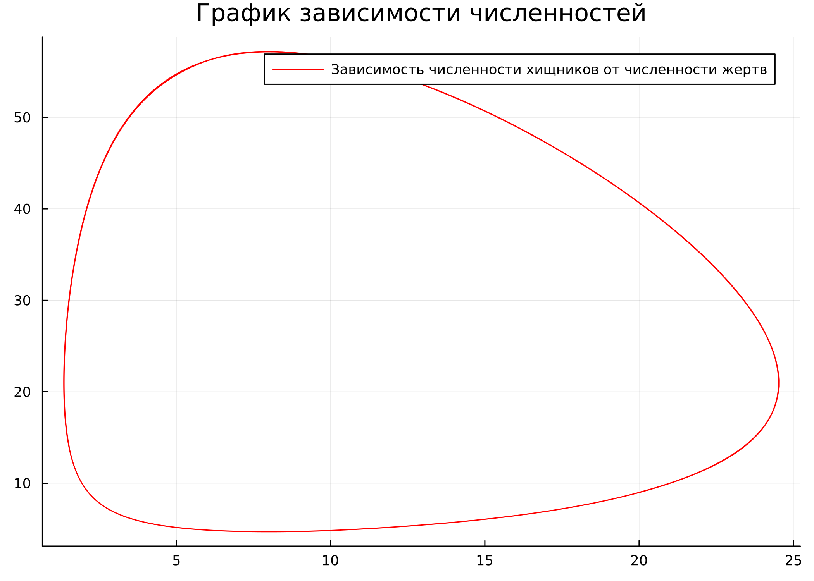
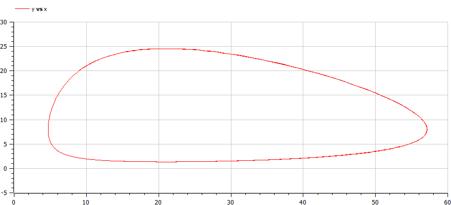
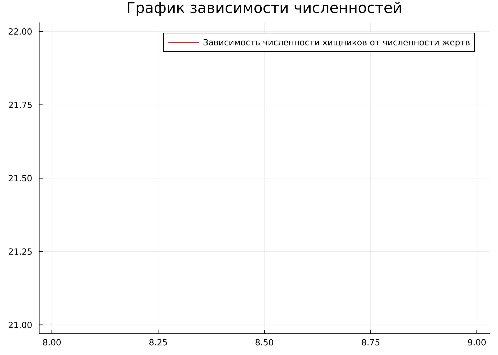

---
## Front matter
title: "Отчёт по лабораторной работе №5"
subtitle: "Дисциплина: Математическое моделирование"
author: "Выполнил: Танрибергенов Эльдар"

## Generic options
lang: ru-RU
toc-title: "Содержание"

## Bibliography
bibliography: ../bib/cite.bib
csl: ../pandoc/csl/gost-r-7-0-5-2008-numeric.csl

## Pdf output format
toc: true # Table of contents
toc-depth: 2
lof: true # List of figures
lot: true # List of tables
fontsize: 12pt
linestretch: 1.5
papersize: a4
documentclass: scrreprt
## I18n polyglossia
polyglossia-lang:
  name: russian
  options:
	- spelling=modern
	- babelshorthands=true
polyglossia-otherlangs:
  name: english
## I18n babel
babel-lang: russian
babel-otherlangs: english
## Fonts
mainfont: PT Serif
romanfont: PT Serif
sansfont: PT Sans
monofont: PT Mono
mainfontoptions: Ligatures=TeX
romanfontoptions: Ligatures=TeX
sansfontoptions: Ligatures=TeX,Scale=MatchLowercase
monofontoptions: Scale=MatchLowercase,Scale=0.9
## Biblatex
biblatex: true
biblio-style: "gost-numeric"
biblatexoptions:
  - parentracker=true
  - backend=biber
  - hyperref=auto
  - language=auto
  - autolang=other*
  - citestyle=gost-numeric
## Pandoc-crossref LaTeX customization
figureTitle: "Рис."
tableTitle: "Таблица"
listingTitle: "Листинг"
lofTitle: "Список иллюстраций"
lotTitle: "Список таблиц"
lolTitle: "Листинги"
## Misc options
indent: true
header-includes:
  - \usepackage{indentfirst}
  - \usepackage{float} # keep figures where there are in the text
  - \floatplacement{figure}{H} # keep figures where there are in the text
---

# Цель работы

Рассмотреть простейшую модель взаимодействия двух видов типа «хищник — жертва» -
модель Лотки-Вольтерры. Выполнить задание согласно варианту: построить график зависимости численности хищников от численности жертв, а также графики изменения численности хищников и численности жертв при заданных начальных условиях, найти стационарное сосотояние системы.

# Задание

**Вариант № 45**:

Для модели «хищник-жертва»:

 $$
   \begin{cases}
     \frac{dx}{dt} = -0.32x(t)+0.04x(t)y(t)
     \\
     \frac{dy}{dt} = 0.42y(t)-0.02x(t)y(t)
   \end{cases}
$$ {#eq:01}

Постройте график зависимости численности хищников от численности жертв,
а также графики изменения численности хищников и численности жертв при
следующих начальных условиях: $x_0 = 9$, $y_0 = 20$. Найдите стационарное
состояние системы.

# Теоретическое введение

Впервые модель «хищник – жертва» была получена А. Лоткой в 1925 году, который использовал ее для описания динамики взаимодействующих биологических популяций. В 1926 году независимо от Лотки аналогичные (к тому же более сложные) модели были разработаны итальянским математиком В. Вольтерра [@key-1].

В 1931 году Вито Вольтеррой были выведены следующие законы отношения хищник-жертва:

 - закон периодического цикла – процесс уничтожения жертвы хищником нередко приводит к периодическим колебаниям численности популяций обоих видов, зависящим только от скорости роста плотоядных и растительноядных, и от исходного соотношения их численности;

- закон сохранения средних величин – средняя численность каждого вида постоянна, независимо от начального уровня, при условии, что специфические скорости увеличения численности популяций, а также эффективность хищничества постоянны;

- закон нарушения средних величин – при сокращении обоих видов пропорционально их числу, средняя численность популяции жертвы растет, а хищников – падает [@key-2].

**Модель хищник-жертва** – это особая взаимосвязь хищника с жертвой, в результате которой выигрывают оба. Выживают наиболее здоровые и приспособленные особи к условиям среды обитания, т.е. все это происходит благодаря естественному отбору. В той среде где нет возможности для размножения, хищник рано или поздно уничтожит популяцию жертвы, в последствии чего вымрет и сам.

Данная двувидовая модель основывается на
следующих предположениях:

- численность популяции жертв $y$ и хищников $x$ зависят только от времени
(модель не учитывает пространственное распределение популяции на
занимаемой территории);

- в отсутствии взаимодействия численность видов изменяется по модели
Мальтуса, при этом число жертв увеличивается, а число хищников падает;

- естественная смертность жертвы и естественная рождаемость хищника
считаются несущественными;

- эффект насыщения численности обеих популяций не учитывается;

- скорость роста численности жертв уменьшается пропорционально
численности хищников [@key-3].

$$
   \begin{cases}
     \frac{dx}{dt} = -ax(t)+bx(t)y(t)
     \\
     \frac{dy}{dt} = cy(t)-dx(t)y(t)
   \end{cases}
$$ {#eq:02}

В этой модели $x$ – число хищников, $y$ - число жертв. Коэффициент $c$
описывает скорость естественного прироста числа жертв в отсутствие хищников, $a$ - естественное вымирание хищников, лишенных пищи в виде жертв. Вероятность
взаимодействия жертвы и хищника считается пропорциональной как количеству
жертв, так и числу самих хищников ($xy$). Каждый акт взаимодействия уменьшает
популяцию жертв, но способствует увеличению популяции хищников (члены $dxy$
и $-bxy$ в правой части уравнения) [@key-3]. 

{#fig:001 width=70%}

Математический анализ этой (жесткой) модели показывает, что имеется
стационарное состояние ($A$ на рис. @fig:001), всякое же другое начальное состояние ($B$) приводит к периодическому колебанию численности как жертв, так и хищников,
так что по прошествии некоторого времени система возвращается в состояние $B$.
Стационарное состояние системы (-@eq:02) (положение равновесия, не зависящее
от времени решение) будет в точке: $x_0=\frac{c}{d}$, $y_0=\frac{a}{b}$.Если начальные значения
задать в стационарном состоянии $x(0)=x_0$, $y(0)=y_0$, в любой момент времени
численность популяций изменяться не будет. При малом отклонении от положения
равновесия численности как хищника, так и жертвы с течением времени не
возвращаются к равновесным значениям, а совершают периодические колебания
вокруг стационарной точки [@key-3]. 


# Выполнение лабораторной работы

1. Задание в лабораторной работе выполняется по вариантам. Вариант расчитывается как остаток от деления номера студенческого билета на число заданий + 1. Таким образом, мой вариант **45**: 1032208074 % 70 + 1.

2. По моему варианту $x$ - число хищников, а $y$ - число жертв, $a$, $d$ - коэффициенты смертности, 
$b$, $c$ - коэффициенты прироста популяции. Сопоставляя общий вид системы(-@eq:02) и систему из моего варианта (-@eq:01) можем определть коэффициенты: $a=0.32$, $b=0.04$, $c=0.42$, $d=0.02$.

3. Напишем код для построения графика зависимости численности хищников от численности жертв,
а также графиков изменения численности хищников и численности жертв на Julia:

```
#подключаем модули
using Plots
using DifferentialEquations

#задаем начальные условия
const x0 = 9
const y0 = 20

#состояние системы 
u0 = [x0, y0]
#отслеживаемый промежуток времени
time = [0.0, 30.0] 

#задаем константы согласно варианту 
a = 0.32
b = 0.04
c = 0.42
d = 0.02

#сама система 
function M!(du, u, p, t)
	du[1] = -a*u[1]+b*u[1]*u[2]
	du[2] = c*u[2]-d*u[1]*u[2]
end

prob = ODEProblem(M!, u0, time)
sol = solve(prob, saveat=0.05)

const X = Float64[]
const Y = Float64[]

for u in sol.u
	x, y = u
	push!(X,x)
	push!(Y,y)
end
 
#постреоние графиков 
plt1 = plot( dpi = 300, size = (700,500), title ="Изменение численности хищников и численности жертв")

plot!( plt1, sol.t, X, color =:red, label ="Численность хищников")

plot!( plt1, sol.t, Y, color =:blue, label ="Численность жертв")

savefig(plt1, "Jl1.png")

plt2 = plot( dpi = 300, size = (700,500), title ="График зависимости численностей")

plot!( plt2, Y, X, color =:red, label ="Зависимость численности хищников от численности жертв")

savefig(plt2, "Jl_php1.png")

```

4. Напишем код ддля построения графика зависимости численности хищников от численности жертв,
а также графиков изменения численности хищников и численности жертв на OpenModelica:

```
model lab05

 Real x(start=9.0);
 Real y(start=20.0);
 constant Real a = 0.32;
 constant Real b = 0.04;
 constant Real c = 0.42;
 constant Real d = 0.02;
  
equation
  der(x) = -a*x+b*x*y;
  der(y) = c*y-d*x*y;

end lab05;

```

5. Видим результаты, полученные с помощью Julia: график зависимости численности хищников от численности жертв (рис. @fig:002) и графики изменения численности хищников и численности жертв (рис. @fig:003).

{#fig:002 width=70%}

{#fig:003 width=70%}

6. Видим результаты, полученные с помощью OpenModelica: график зависимости численности хищников от численности жертв (рис. @fig:004) и графики изменения численности хищников и численности жертв (рис. @fig:005).

{#fig:004 width=70%}

{#fig:005 width=70%}

7. Теперь на нужно найти стационарное состояние. Оно, как уже было описано выше, находится как $x_0=\frac{a}{b}$, $y_0=\frac{c}{d}$. Удобнее всего будет сразу посчитать его в Julia, поэтому напишем код на Julia, в котором будет считаться и выводиться на экран стационарное состоояние. Кроме того, если стационарное состояние посчитано верно и подставлено в начальные значения численности хищников и жертв, графики изменения численности хищников и численности жертв будут выглядеть как две параллельные прямые, а график зависимости численности хищников от численности жертв будет точкой. Для проверки правильности подставим полученное стационарное в наш код на Julia.

8.  Напишем код для расчета и проверки стационарного состояния на Julia:

```
#подключаем модули
using Plots
using DifferentialEquations

#задаем коэффициенты согласно варианту 
a = 0.32
b = 0.04
c = 0.42
d = 0.02

#задаем начальные условия
x0 = c / d
y0 = a / b

#состояние системы 
u0 = [x0, y0]
#отслеживаемый промежуток времени
time = [0.0, 120.0] 

print("x0 = ")
println(x0)
print("y0 = ")
println(y0)

#сама система 
function M!(du, u, p, t)
	du[1] = -a*u[1]+b*u[1]*u[2]
	du[2] = c*u[2]-d*u[1]*u[2]
end

prob = ODEProblem(M!, u0, time)
sol = solve(prob, saveat=0.05)

const X = Float64[]
const Y = Float64[]

for u in sol.u
	x, y = u
	push!(X,x)
	push!(Y,y)
end
 
#постреоние графиков 
plt1 = plot( dpi = 300, size = (700,500), title ="Изменение численности хищников и численности жертв")

plot!( plt1, sol.t, X, color =:red, label ="Численность хищников")

plot!( plt1, sol.t, Y, color =:blue, label ="Численность жертв")

savefig(plt1, "Jl2.png")

plt2 = plot( dpi = 300, size = (700,500), title ="График зависимости численностей")

plot!( plt2, Y, X, color =:red, label ="Зависимость численности хищников от численности жертв")

savefig(plt2, "Jl_php2.png")
```

9. Посмотрим на результаты, полученные с помощью Julia для расчета (рис. @fig:006) и проверки (рис. [@fig:007-@fig:008]) стационарного состояния. Видим, что полученный результат верен. Фазовый портрет физуально выглядит не точкой, однако, если мы посмотрим на значения на осях, видим, что числа очень малы. Так, это просто погрешность вычислений, фактически это точка.

{#fig:006 width=70%}

{#fig:007 width=70%}

{#fig:008 width=70%}

# Выводы

## Вывод

Я рассмотрел простейшую модель взаимодействия двух видов типа «хищник — жертва» -
модель Лотки-Вольтерры. Выполнил задание согласно варианту: построил график зависимости численности хищников от численности жертв, а также графики изменения численности хищников и численности жертв при заданных начальных условиях, нашёл стационарное сосотояние системы.

# Список литературы{.unnumbered}

::: {#refs}
:::
