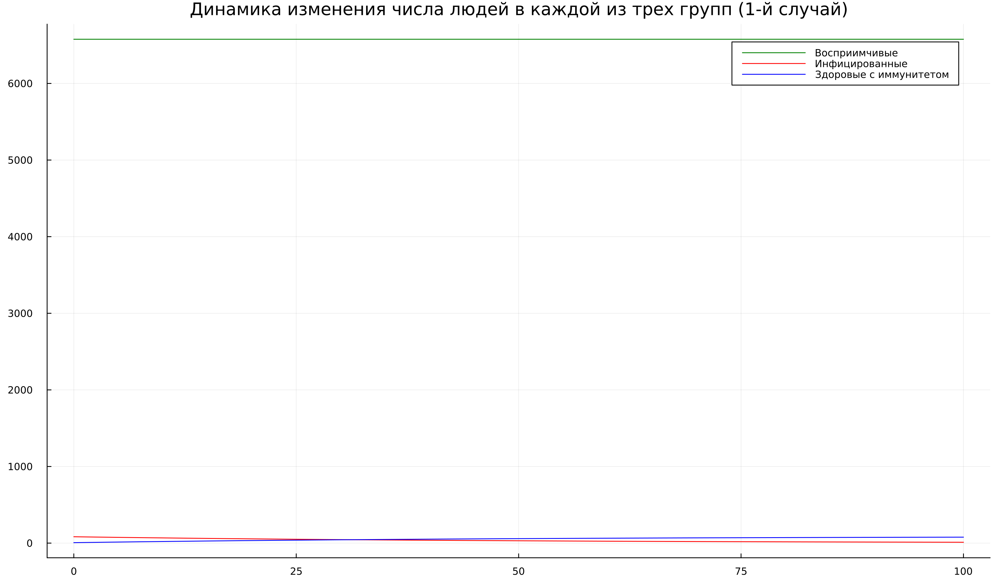
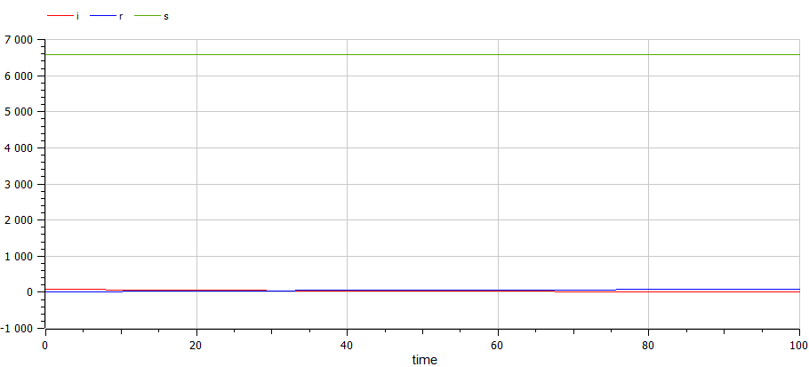
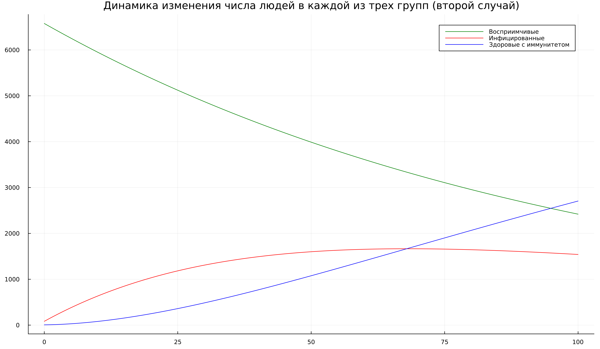
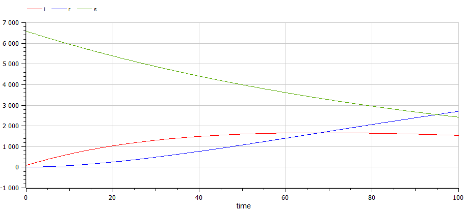

---
## Front matter
lang: ru-RU
title: Лабораторная работа №6
subtitle: Задача об эпидемии
author:
  - Танрибергенов Эльдар
institute:
  - Российский университет дружбы народов, Москва, Россия
date: 2023 г.

## i18n babel
babel-lang: russian
babel-otherlangs: english

## Formatting pdf
toc: false
toc-title: Содержание
slide_level: 2
aspectratio: 169
section-titles: true
theme: metropolis
header-includes:
 - \metroset{progressbar=frametitle,sectionpage=progressbar,numbering=fraction}
 - '\makeatletter'
 - '\beamer@ignorenonframefalse'
 - '\makeatother'
---

## Цели и задачи

Рассмотреть простейшую модель эпидемии на примере задачи.

Задача:

На одном острове вспыхнула эпидемия. Известно, что из всех проживающих
на острове ($N=6 666$) в момент начала эпидемии ($t=0$) число заболевших людей
(являющихся распространителями инфекции) $I(0)=83$, а число здоровых людей с
иммунитетом к болезни $R(0)=6$. Таким образом, число людей восприимчивых к
болезни, но пока здоровых, в начальный момент времени $S(0)=N-I(0)-R(0)$.

Построить графики изменения числа особей в каждой из трех групп.
Рассмотреть, как будет протекать эпидемия в случае:

1. если $I(0) \leq I^*$

2. если $I(0) > I^*$

## Материалы и методы

- Julia
- OpenModelica

# Выполнение работы

## Изучение теории
:::::::::::::: {.columns align=center}
::: {.column width="50%"}

Если $I(0) \leq I^*$, то 

$$
   	\begin{cases}
    	\frac{dS}{dt} = 0
     	\\
     	 \frac{dI}{dt} = - \beta I
	 	 \\
	 	 \frac{dR}{dt} = \beta I
   		\end{cases}
	$$ 

:::
::: {.column width="50%"}

Если $I(0) > I^*$ 

$$
   		\begin{cases}
     	 \frac{dS}{dt} = -\alpha S
     	 \\
     	 \frac{dI}{dt} = \alpha S- \beta I
	 	 \\
	 	 \frac{dR}{dt} = \beta I
   	\end{cases}
	$$ 

:::
::::::::::::::

## Написание кода для первого случая
:::::::::::::: {.columns align=center}
::: {.column width="50%"}
Фрагмент кода на Julia

:::
::: {.column width="50%"}

Код на OpenModelica

:::
::::::::::::::

## Результаты для первого случая

:::::::::::::: {.columns align=center}
::: {.column width="50%"}

Из Julia

:::
::: {.column width="50%"}

Из OpenModelica

:::
::::::::::::::

## Результаты, для первого случая

## Написание кода для второго случая
:::::::::::::: {.columns align=center}
::: {.column width="50%"}
Фрагмент кода на Julia

:::
::: {.column width="50%"}

Код на OpenModelica

:::
::::::::::::::

## Результаты для второго случая

:::::::::::::: {.columns align=center}
::: {.column width="50%"}

Из Julia

:::
::: {.column width="50%"}

Из OpenModelica

:::
::::::::::::::

# Результаты

## Результат

Рассмотрена простейшая модель эпидемии на примере задачи. Построены графики изменения числа особей в каждой из трех групп.
Рассмотрено, как будет протекать эпидемия в случае:

1. если $I(0) \leq I^*$

2. если $I(0) > I^*$

# Вывод

## Вывод

Я рассмотрел простейшую модель эпидемии. Выполнил задание согласно варианту: построил графики изменения числа особей в каждой из трех групп для двух случаев.