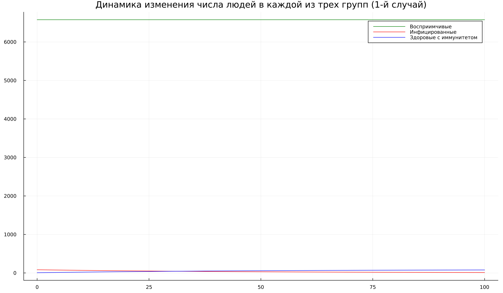
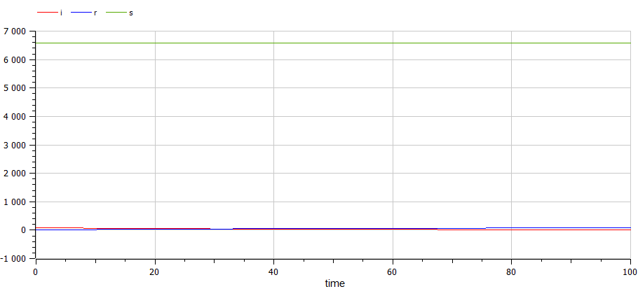
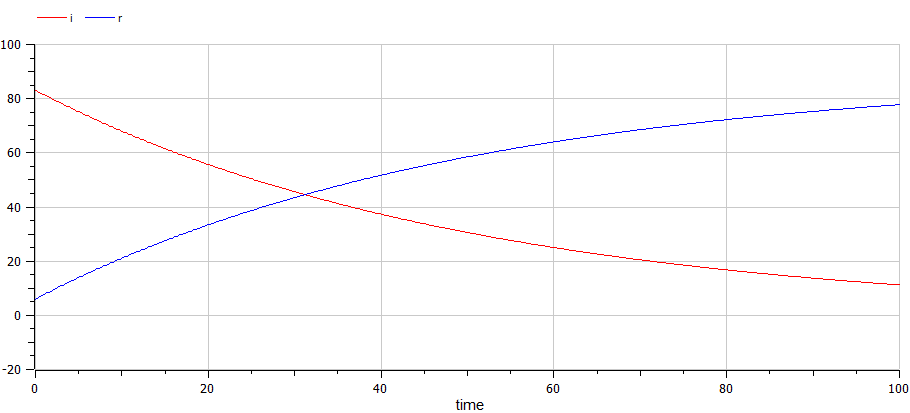
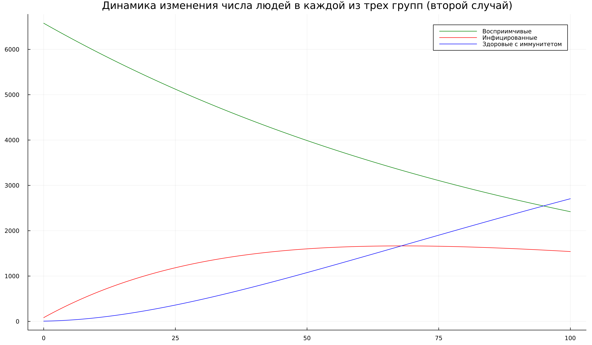
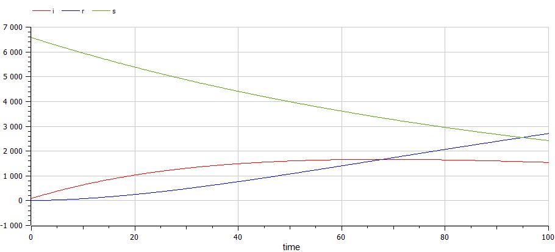

---
## Front matter
title: "Отчет по лабораторной работе №6"
subtitle: "Дисциплина: Математическое моделирование"
author: "Выполнил: Танрибергенов Эльдар"

## Generic otions
lang: ru-RU
toc-title: "Содержание"

## Bibliography
bibliography: ../bib/cite.bib
csl: ../pandoc/csl/gost-r-7-0-5-2008-numeric.csl

## Pdf output format
toc: true # Table of contents
toc-depth: 2
lof: true # List of figures
lot: true # List of tables
fontsize: 12pt
linestretch: 1.5
papersize: a4
documentclass: scrreprt
## I18n polyglossia
polyglossia-lang:
  name: russian
  options:
	- spelling=modern
	- babelshorthands=true
polyglossia-otherlangs:
  name: english
## I18n babel
babel-lang: russian
babel-otherlangs: english
## Fonts
mainfont: PT Serif
romanfont: PT Serif
sansfont: PT Sans
monofont: PT Mono
mainfontoptions: Ligatures=TeX
romanfontoptions: Ligatures=TeX
sansfontoptions: Ligatures=TeX,Scale=MatchLowercase
monofontoptions: Scale=MatchLowercase,Scale=0.9
## Biblatex
biblatex: true
biblio-style: "gost-numeric"
biblatexoptions:
  - parentracker=true
  - backend=biber
  - hyperref=auto
  - language=auto
  - autolang=other*
  - citestyle=gost-numeric
## Pandoc-crossref LaTeX customization
figureTitle: "Рис."
tableTitle: "Таблица"
listingTitle: "Листинг"
lofTitle: "Список иллюстраций"
lotTitle: "Список таблиц"
lolTitle: "Листинги"
## Misc options
indent: true
header-includes:
  - \usepackage{indentfirst}
  - \usepackage{float} # keep figures where there are in the text
  - \floatplacement{figure}{H} # keep figures where there are in the text
---

# Цель работы

Рассмотреть простейшую модель эпидемии. Выполнить задание согласно варианту: построить графики изменения числа особей в каждой из трех групп для двух случаев.

# Задание

**Вариант № 45**:

На одном острове вспыхнула эпидемия. Известно, что из всех проживающих
на острове ($N=6 666$) в момент начала эпидемии ($t=0$) число заболевших людей
(являющихся распространителями инфекции) $I(0)=83$, а число здоровых людей с
иммунитетом к болезни $R(0)=6$. Таким образом, число людей восприимчивых к
болезни, но пока здоровых, в начальный момент времени $S(0)=N-I(0)-R(0)$.

Построить графики изменения числа особей в каждой из трех групп.
Рассмотреть, как будет протекать эпидемия в случае:

1. если $I(0) \leq I^*$

2. если $I(0) > I^*$

# Теоретическое введение

За многие годы существования человечества огромное число людей погибло от различных эпидемий. Чума, холера, грипп и др. нередко поражали значительные массы людей. Для того, чтобы иметь возможность бороться с эпидемиями, т.е. своевременно применять те или иные медицинские мероприятия (карантины, вакцинации и т.п.),необходимо уметь сравнивать эффективность этих мероприятий. Сравнить же их можно лишь в том случае, если есть возможность предсказать, как при том или ином мероприятии будет меняться ход эпидемии, т.е. как будет меняться число заболевших.

Отсюда возникает необходимость в построении модели, которая могла бы служить целям прогноза [@key-1].

Основу эпидемиологического моделирования составляют так называемые компартментальные модели. Они используются для упрощения математического моделирования инфекционных заболеваний. 

Компартментальные модели, как правило, исследуются с помощью систем обыкновенных дифференциальных уравнений (детерминированных), но их также можно рассматривать и в стохастической структуре, которая является более реалистичной, но и более сложной для анализа. 

Компартментальные модели могут использоваться для прогнозирования свойств распространения некоторого заболевания, таких например, как распространенность заболевания или продолжительность соответствующей эпидемии. Кроме того, компартментальные модели позволяют понять, как различные факторы, будь то закрытие общественных мест, улучшение гигиены или карантин самоизоляция, могут влиять на ход эпидемии [@key-2].

Одной из простейших компартментальных моделей является модель **SIR**. Многие более сложные эпидемиологические модели строятся уже на её основе. Согласно модели **SIR** индивиды делятся на три группы: **S** (susceptible) – восприимчивые к заболеванию, **I** (infectious) – инфицированные и **R** (recovered) – выздоровевшие. Название последней группы иногда указывают как removed, и это лучше отражает её суть, поскольку в эту группу в такой простой модели входят не только выздоровевшие, но и все индивиды, которые переболели, умершие (deceased) в том числе. Иначе говоря, последняя группа – это переболевшие [@key-2].

Рассмотрим простейшую модель эпидемии. Предположим, что некая
популяция, состоящая из $N$ особей, (считаем, что популяция изолирована)
подразделяется на три группы. Первая группа - это восприимчивые к болезни, но
пока здоровые особи, обозначим их через $S(t)$. Вторая группа – это число
инфицированных особей, которые также при этом являются распространителями
инфекции, обозначим их $I(t)$. А третья группа, обозначающаяся через $R(t)$ – это
здоровые особи с иммунитетом к болезни.
До того, как число заболевших не превышает критического значения $I^*$, считаем, что все больные изолированы и не заражают здоровых. Когда $I(t)>I^*$,
тогда инфицирование способны заражать восприимчивых к болезни особей.
Таким образом, скорость изменения числа $S(t)$ меняется по следующему
закону:

$$
\frac{dS}{dt} = 
 \begin{cases}
   -\alpha S, &\text{если $I(t)>I^*$}
   \\
   0, &\text{если $I(t) \leq I^*$}
 \end{cases}
$$ {#eq:01}

Поскольку каждая восприимчивая к болезни особь, которая, в конце концов,
заболевает, сама становится инфекционной, то скорость изменения числа
инфекционных особей представляет разность за единицу времени между
заразившимися и теми, кто уже болеет и лечится, т.е.:

$$
\frac{dI}{dt} = 
 \begin{cases}
   \alpha S -\beta I, &\text{если $I(t)>I^*$}
   \\
   -\beta I, &\text{если $I(t) \leq I^*$}
 \end{cases}
$$ {#eq:02}

А скорость изменения выздоравливающих особей (при этом приобретающие
иммунитет к болезни)

$$  
\frac{dR}{dt} = -\beta I
$$ {#eq:03}

Постоянные пропорциональности
$\alpha$, $\beta$, - это коэффициенты заболеваемости
и выздоровления соответственно.
Для того, чтобы решения соответствующих уравнений определялось
однозначно, необходимо задать начальные условия. Для анализа картины протекания эпидемии необходимо
рассмотреть два случая: $I(0) \leq I^*$ и $I(0) > I^*$ [@key-3].

# Выполнение лабораторной работы

1. Задание в лабораторной работе выполняется по вариантам. Вариант расчитывается как номер остаток от деления номера студенческого билета на число заданий + 1. Таким образом, мой вариант **45**: 1032208074 % 70 + 1.

2. Исходя из теории, описанной в теоретическом введении, видим, что нам требуется решить две системы уравнений. Если $I(0) \leq I^*$, то 

	$$
   		\begin{cases}
    	 \frac{dS}{dt} = 0
     	 \\
     	 \frac{dI}{dt} = - \beta I
	 	 \\
	 	 \frac{dR}{dt} = \beta I
   		\end{cases}
	$$ {#eq:04}

   Если $I(0) > I^*$ 

	$$
   		\begin{cases}
     	 \frac{dS}{dt} = -\alpha S
     	 \\
     	 \frac{dI}{dt} = \alpha S- \beta I
	 	 \\
	 	 \frac{dR}{dt} = \beta I
   	\end{cases}
	$$ {#eq:05}

	Кроме того, зададим коэффициенты заболеваемости и выздоровления как $\alpha=0.01$ и $\beta=0.02$ (значения взял из примера в описании к лабораторной работе).

3. Напишем код для первого ($I(0) \leq I^*$) случая на Julia:

```
#подключаем модули
using Plots
using DifferentialEquations

#задаем начальные условия
N = 6666
I0 = 83
R0 = 6
S0 = N-I0-R0
a=0.01 #коэффициент заболеваемости
b=0.02 #коэффициент выздоровления

#состояние системы 
u0 = [S0, I0, R0]
#отслеживаемый промежуток времени
time = [0.0, 100.0] 

#сама система 
function M!(du, u, p, t)
	du[1] = 0
	du[2] = -b*u[2]
	du[3] = b*u[2]
end

prob = ODEProblem(M!, u0, time)
sol = solve(prob, saveat=0.1)

const S = Float64[]
const I = Float64[]
const R = Float64[]

for u in sol.u
	s, i, r = u
	push!(S,s)
	push!(I,i)
	push!(R,r)
end
 
#постреоние графиков 
plt1 = plot( dpi = 300, size = (1200,700), title ="Динамика изменения числа людей в каждой из трех групп (1-й случай)")

plot!( plt1, sol.t, S, color =:red, label ="Восприимчивые")

plot!( plt1, sol.t, I, color =:blue, label ="Инфицированные")

plot!( plt1, sol.t, R, color =:green, label ="Здоровые с иммунитетом")

savefig(plt1, "Jl_case1.png")

```

4. Напишем код для первого ($I(0) \leq I^*$) случая на OpenModelica:

```
model lr6
 constant Integer n = 6666;
 constant Integer i_0 = 83;
 constant Integer r_0 = 6;
 constant Integer s_0 = n-i_0-r_0;
 
 constant Real a = 0.01;
 constant Real b = 0.02;

 Real s(start=s_0);
 Real i(start=i_0);
 Real r(start=r_0);
  
equation
  der(s) = 0;
  der(i) = -b*i;
  der(r) = b*i;
end lr6;

```

5. Видим результаты, полученные для первого ($I(0) \leq I^*$) случая с помощью Julia (рис. @fig:001).

{#fig:001 width=70%}

6. Видим результаты, полученные для первого ($I(0) \leq I^*$) случая с помощью OpenModelica (рис. @fig:002).

{#fig:002 width=70%}

7. Так как значение восприимчивых у нас сильно больше, чем остальных двух групп, на графике плохо видно, что происходит с инфицированными и здоровыми с иммунитетом. Поэтому я оставил только их графики в OpenModelica, чтобы посмотреть более наглядно (рис. @fig:003).

{#fig:003 width=70%}

8. Напишем код для второго ($I(0) > I^*$) случая на Julia:

```
#подключаем модули
using Plots
using DifferentialEquations

#задаем начальные условия
N = 6666
I0 = 83
R0 = 6
S0 = N-I0-R0
a=0.01 #коэффициент заболеваемости
b=0.02 #коэффициент выздоровления

#состояние системы 
u0 = [S0, I0, R0]
#отслеживаемый промежуток времени
time = [0.0, 100.0] 

#сама система 
function M!(du, u, p, t)
	du[1] = -a*u[1]
	du[2] = a*u[1]-b*u[2]
	du[3] = b*u[2]
end

prob = ODEProblem(M!, u0, time)
sol = solve(prob, saveat=0.1)

const S = Float64[]
const I = Float64[]
const R = Float64[]

for u in sol.u
	s, i, r = u
	push!(S,s)
	push!(I,i)
	push!(R,r)
end
 
#постреоние графиков 
plt1 = plot( dpi = 300, size = (1200,700), title ="Динамика изменения числа людей в каждой из трех групп (второй случай)")

plot!( plt1, sol.t, S, color =:red, label ="Восприимчивые")

plot!( plt1, sol.t, I, color =:blue, label ="Инфицированные")

plot!( plt1, sol.t, R, color =:green, label ="Здоровые с иммунитетом")

savefig(plt1, "Jl_case2.png")

```

9. Напишем код для второго ($I(0) > I^*$) случая на OpenModelica:

```
model lr62
 constant Integer n = 6666;
 constant Integer i_0 = 83;
 constant Integer r_0 = 6;
 constant Integer s_0 = n-i_0-r_0;
 
 constant Real a = 0.01;
 constant Real b = 0.02;

 Real s(start=s_0);
 Real i(start=i_0);
 Real r(start=r_0);
  
equation
  der(s) = -a*s;
  der(i) = a*s-b*i;
  der(r) = b*i;

end lr62;

```

10. Видим результаты, полученные для второго ($I(0) > I^*$) случая с помощью Julia (рис. @fig:004).

{#fig:004 width=70%}

11. Видим результаты, полученные для второго ($I(0) > I^*$) случая с помощью OpenModelica (рис. @fig:005).

{#fig:005 width=70%}

12. Как мы видим, в первом случае численность в каждой группе не особо ярко изменяется. Во втором же случае постепенно численность восприимчивых, но здоровых уменьшается, число здоровых с иммунитетом увеличивается.

# Выводы

Я рассмотрел простейшую модель эпидемии. Выполнил задание согласно варианту: построил графики изменения числа особей в каждой из трех групп для двух случаев.


# Список литературы{.unnumbered}

::: {#refs}
:::
