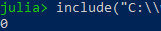
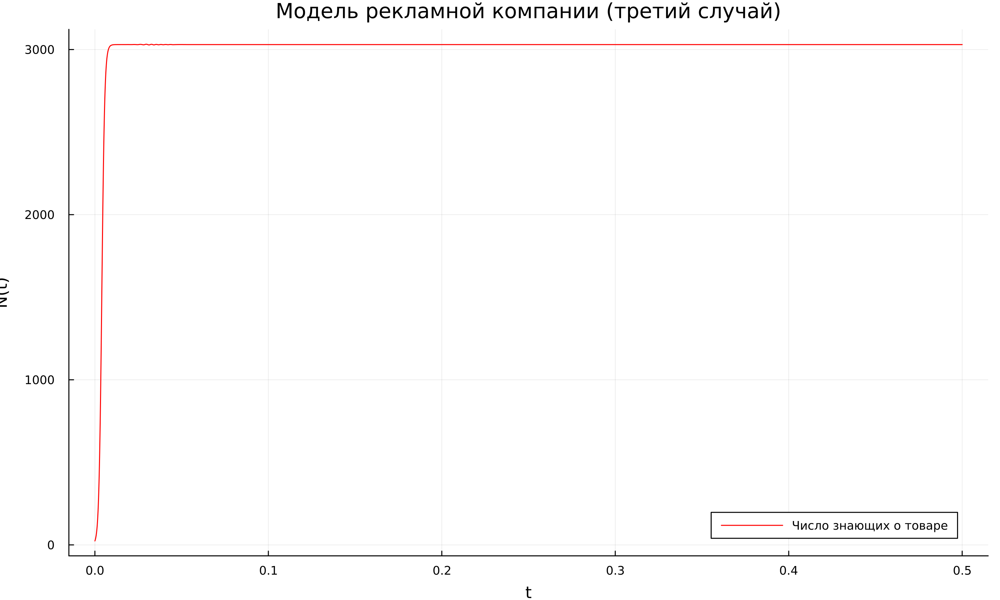
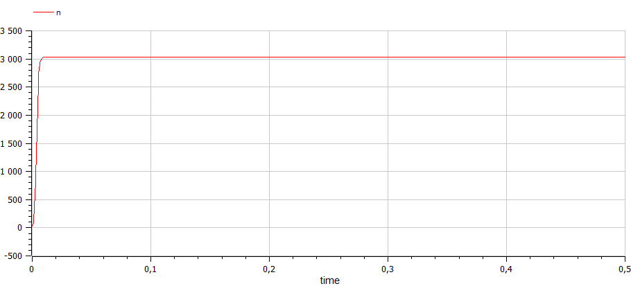

---
## Front matter
lang: ru-RU
title: Лабораторная работа №7
subtitle: Эффективность рекламы
author:
  - Танрибергенов Эльдар
institute:
  - Российский университет дружбы народов, Москва, Россия
date: 2023 г.

## i18n babel
babel-lang: russian
babel-otherlangs: english

## Formatting pdf
toc: false
toc-title: Содержание
slide_level: 2
aspectratio: 169
section-titles: true
theme: metropolis
header-includes:
 - \metroset{progressbar=frametitle,sectionpage=progressbar,numbering=fraction}
 - '\makeatletter'
 - '\beamer@ignorenonframefalse'
 - '\makeatother'
---

## Цели и задачи

Рассмотреть модель рекламной компании. 

Построить график распространения рекламы, математическая модель которой описывается следующим уравнением: 

1. $\frac{dn}{dt}=(0.288 + 0.000018n(t))(N-n(t))$

2. $\frac{dn}{dt}=(0.000018 + 0.377n(t))(N-n(t))$

2. $\frac{dn}{dt}=(0.1t + 0.4\cos(t)n(t))(N-n(t))$

При этом объём аудитории $N=3030$, в начальный момент о товаре знает $24$ человек. Для
случая 2 определить в какой момент времени скорость распространения рекламы будет
иметь максимальное значение.

## Материалы и методы

- Julia
- OpenModelica

# Выполнение работы

## Написание кода для первого случая
:::::::::::::: {.columns align=center}
::: {.column width="50%"}
Фрагмент кода на Julia

:::
::: {.column width="50%"}

Код на OpenModelica

:::
::::::::::::::

## Результаты для первого случая

:::::::::::::: {.columns align=center}
::: {.column width="50%"}

Из Julia

:::
::: {.column width="50%"}

Из OpenModelica

:::
::::::::::::::

## Написание кода для второго случая
:::::::::::::: {.columns align=center}
::: {.column width="50%"}
Фрагмент кода на Julia

:::
::: {.column width="50%"}

Код на OpenModelica

:::
::::::::::::::

## Результаты для второго случая

:::::::::::::: {.columns align=center}
::: {.column width="50%"}

Из Julia

:::
::: {.column width="50%"}

Из OpenModelica

:::
::::::::::::::

## Результаты для второго случая

 Время, где достигается наибольший рост

 

## Написание кода для третьего случая
:::::::::::::: {.columns align=center}
::: {.column width="50%"}
Фрагмент кода на Julia

:::
::: {.column width="50%"}

Код на OpenModelica

:::
::::::::::::::

## Результаты для третьего случая

:::::::::::::: {.columns align=center}
::: {.column width="50%"}

Из Julia

:::
::: {.column width="50%"}

Из OpenModelica

:::
::::::::::::::

# Результаты

## Результат

Построены график распространения рекламы, математическая модель которой описывается следующим уравнением: 

1. $\frac{dn}{dt}=(0.288 + 0.000018n(t))(N-n(t))$

2. $\frac{dn}{dt}=(0.000018 + 0.377n(t))(N-n(t))$

3. $\frac{dn}{dt}=(0.1t + 0.4\cos(t)n(t))(N-n(t))$

Для случая 2 определено в какой момент времени скорость распространения рекламы будет
иметь максимальное значение = 0.

# Вывод

## Вывод

Я рассмотрел модель рекламной компании. Выполнил задание согласно варианту: построил график распространения рекламы, математическая модель которой описывается заданным уравнением (три случая), определил в какой момент времени скорость распространения рекламы будет иметь максимальное значение.