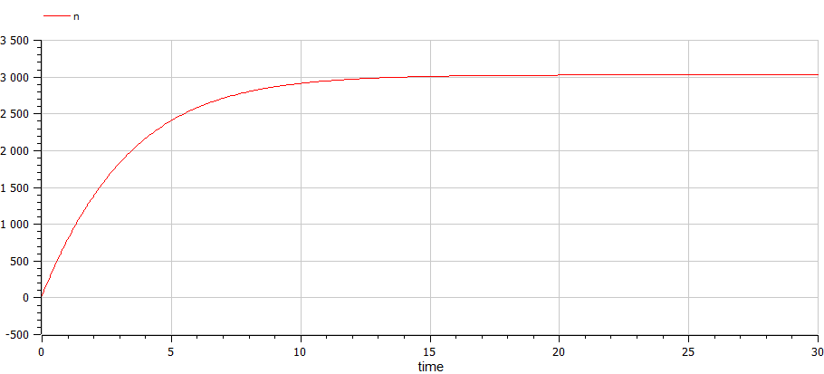

---
## Front matter
title: "Отчет по лабораторной работе №7"
subtitle: "Дисциплина: Математическое моделирование"
author: "Выполнил: Танрибергенов Эльдар"

## Generic options
lang: ru-RU
toc-title: "Содержание"

## Bibliography
bibliography: ../bib/cite.bib
csl: ../pandoc/csl/gost-r-7-0-5-2008-numeric.csl

## Pdf output format
toc: true # Table of contents
toc-depth: 2
lof: true # List of figures
lot: true # List of tables
fontsize: 12pt
linestretch: 1.5
papersize: a4
documentclass: scrreprt
## I18n polyglossia
polyglossia-lang:
  name: russian
  options:
	- spelling=modern
	- babelshorthands=true
polyglossia-otherlangs:
  name: english
## I18n babel
babel-lang: russian
babel-otherlangs: english
## Fonts
mainfont: PT Serif
romanfont: PT Serif
sansfont: PT Sans
monofont: PT Mono
mainfontoptions: Ligatures=TeX
romanfontoptions: Ligatures=TeX
sansfontoptions: Ligatures=TeX,Scale=MatchLowercase
monofontoptions: Scale=MatchLowercase,Scale=0.9
## Biblatex
biblatex: true
biblio-style: "gost-numeric"
biblatexoptions:
  - parentracker=true
  - backend=biber
  - hyperref=auto
  - language=auto
  - autolang=other*
  - citestyle=gost-numeric
## Pandoc-crossref LaTeX customization
figureTitle: "Рис."
tableTitle: "Таблица"
listingTitle: "Листинг"
lofTitle: "Список иллюстраций"
lotTitle: "Список таблиц"
lolTitle: "Листинги"
## Misc options
indent: true
header-includes:
  - \usepackage{indentfirst}
  - \usepackage{float} # keep figures where there are in the text
  - \floatplacement{figure}{H} # keep figures where there are in the text
---

# Цель работы

Рассмотреть модель рекламной компании. Выполнить задание согласно варианту: построить график распространения рекламы, математическая модель которой описывается заданным уравнением (три случая), определить в какой момент времени скорость распространения рекламы будет иметь максимальное значение.

# Задание

**Вариант № 45**:

Построить график распространения рекламы, математическая модель которой описывается следующим уравнением: 

1. $\frac{dn}{dt}=(0.288 + 0.000018n(t))(N-n(t))$

2. $\frac{dn}{dt}=(0.000018 + 0.377n(t))(N-n(t))$

3. $\frac{dn}{dt}=(0.1t + 0.4\cos(t)n(t))(N-n(t))$

При этом объём аудитории $N=3030$, в начальный момент о товаре знает $24$ человек. Для
случая 2 определить в какой момент времени скорость распространения рекламы будет
иметь максимальное значение.

# Теоретическое введение

Модель проведения рекламной кампании – это сочетание параметров, показателей, технологий и процедур, которые представляют собой схему проведения рекламных мероприятий [@key-1]

Фирма начинает рекламировать новый товар или услугу. Естественно, прибыль от будущих продаж должна значительно покрывать издержки на рекламную кампанию. При этом вначале расходы могут превышать прибыль, поскольку лишь малая часть потенциальных покупателей будет информирована о новинке. Затем, при увеличении числа продаж, появляется возможность рассчитывать на заметную прибыль. Наконец, наступит момент, когда рынок насытится, и рекламировать товар далее станет бессмысленно [@key-2].

Предположим, что торговыми учреждениями реализуется некоторая продукция, о которой в момент времени $t$
из числа потенциальных покупателей
$N$ знает лишь $n$ покупателей. Для ускорения сбыта продукции запускается реклама по радио, телевидению и других средств массовой информации. После запуска рекламной кампании информация о продукции начнет распространяться среди
потенциальных покупателей путем общения друг с другом. Таким образом, после
запуска рекламных объявлений скорость изменения числа знающих о продукции
людей пропорциональна как числу знающих о товаре покупателей, так и числу
покупателей о нем не знающих [@key-3].

Модель рекламной кампании описывается следующими величинами. Считаем, что $\frac{dn}{dt}$ - скорость изменения со временем числа потребителей,
узнавших о товаре и готовых его купить,
$t$ - время, прошедшее с начала рекламной
кампании, $n(t)$ - число уже информированных клиентов. Эта величина
пропорциональна числу покупателей, еще не знающих о нем, это описывается
следующим образом: $\alpha_1(t)(N-n(t))$ где $N$ - общее число потенциальных
платежеспособных покупателей,
$\alpha_1(t)>0$ - характеризует интенсивность
рекламной кампании (зависит от затрат на рекламу в данный момент времени).
Помимо этого, узнавшие о товаре потребители также распространяют полученную
информацию среди потенциальных покупателей, не знающих о нем (в этом случае
работает т.н. сарафанное радио). Этот вклад в рекламу описывается величиной
$\alpha_2(t)n(t)(N-n(t))$, эта величина увеличивается с увеличением потребителей
узнавших о товаре. Математическая модель распространения рекламы описывается
уравнением:

$\frac{dn}{dt}=(\alpha_1(t)+\alpha_2(t)n(t))(N-n(t))$ {#eq:01}

При $\alpha_1(t)>\alpha_2(t)$
получается модель типа модели Мальтуса, решение которой имеет следующий вид (рис. @fig:001)

{#fig:001 width=70%}

В обратном случае, при $\alpha_1(t)<\alpha_2(t)$ получаем уравнение логистической
кривой (рис. @fig:002)

{#fig:002 width=70%}

# Выполнение лабораторной работы

1. Задание в лабораторной работе выполняется по вариантам. Вариант расчитывается как остаток от деления номера студенческого билета на число заданий + 1. Таким образом, мой вариант **45**: 1032208074 % 70 + 1.

2. Напишем код для первого случая на Julia:

```
#подключаем модули
using Plots
using DifferentialEquations

#задаем начальные условия
N = 3030
n0=24
a1=0.288
a2=0.000018 

#состояние системы 
u0 = [n0]
#отслеживаемый промежуток времени
time = [0.0, 30.0] 

#сама система 
function M!(du, u, p, t)
	du[1] = (a1+a2*u[1])*(N-u[1])
end

prob = ODEProblem(M!, u0, time)
sol = solve(prob, saveat=0.0001)

const N_ = Float64[]

for u in sol.u
	n = u[1]
	push!(N_,n)
end
 
#постреоние графиков 
plt1 = plot( dpi = 300, size = (1000,600), title ="Модель рекламной компании (первый случай)")

plot!( plt1, sol.t, N_, color =:red, xlabel="t", ylabel="N(t)", label ="Число знающих о товаре")

savefig(plt1, "Jl_case1.png")

```

3. Видим результат, полученный для первого случая с помощью Julia (рис. @fig:003)

{#fig:003 width=70%}

4. Напишем код для первого случая на OpenModelica:

```
model lr71

 constant Integer N = 3030;
 constant Integer n0 = 24;
 constant Real a1 = 0.288;
 constant Real a2 = 0.000018;

 Real n(start=n0);
  
equation
  der(n) = (a1+a2*n)*(N-n);


end lr71;
```

5. Видим результат, полученный для первого случая с помощью OpenModelica (рис. @fig:004)

{#fig:004 width=70%}

6. Напишем код для второго случая на Julia:

```
#подключаем модули
using Plots
using DifferentialEquations

#задаем начальные условия
N = 3030
n0=24
a1=0.000018
a2=0.377
max=[0.0]
max_t=0

#состояние системы 
u0 = [n0]
#отслеживаемый промежуток времени
time = [0.0, 0.5] 

#сама система 
function M!(du, u, p, t)
	du[1] = (a1+a2*u[1])*(N-u[1])
	if du[1]>max[1]
		max[1]=du[1]
		max_t=t
	end
end

prob = ODEProblem(M!, u0, time)
sol = solve(prob, saveat=0.0001)

println(max_t)

const N_ = Float64[]

for u in sol.u
	n = u[1]
	push!(N_,n)
end
 
#постреоние графиков 
plt1 = plot( dpi = 300, size = (1000,600), title ="Модель рекламной компании (второй случай)")

plot!( plt1, sol.t, N_, color =:red, xlabel="t", ylabel="N(t)", label ="Число знающих о товаре")

savefig(plt1, "../images/Jl_case2.png")
```

7. Видим результат, полученный для второго случая с помощью Julia (рис. @fig:005). Также на экран вывелось время, где достигается наибольший рост, у меня это 0 (рис. @fig:006).

{#fig:005 width=70%}

{#fig:006 width=70%}

8. Напишем код для второго случая на OpenModelica:

```
model lr72
 constant Integer N = 3030;
 constant Integer n0 = 24;
 constant Real a1 = 0.000018;
 constant Real a2 = 0.377;

 Real n(start=n0);
  
equation
  der(n) = (a1+a2*n)*(N-n);

end lr72;

```

9. Видим результат, полученный для второго случая с помощью OpenModelica (рис. @fig:007). 

{#fig:007 width=70%}


10. Напишем код для третьего случая на Julia:

```
#подключаем модули
using Plots
using DifferentialEquations

#задаем начальные условия
N = 3030
n0=24
a1=0.1
a2=0.4

#состояние системы 
u0 = [n0]
#отслеживаемый промежуток времени
time = [0.0, 0.5] 

#сама система 
function M!(du, u, p, t)
	du[1] = (a1+a2*cos(t)*u[1])*(N-u[1])
end

prob = ODEProblem(M!, u0, time)
sol = solve(prob, saveat=0.0001)

const N_ = Float64[]

for u in sol.u
	n = u[1]
	push!(N_,n)
end
 
#постреоние графиков 
plt1 = plot( dpi = 300, size = (1000,600), title ="Модель рекламной компании (третий случай)")

plot!( plt1, sol.t, N_, color =:red, xlabel="t", ylabel="N(t)", label ="Число знающих о товаре")

savefig(plt1, "Jl_case3.png")

```

11. Видим результат, полученный для третьего случая с помощью Julia (рис. @fig:008)

{#fig:008 width=70%}

12. Напишем код для третьего случая на OpenModelica:

```
model lr73
constant Integer N = 3030;
 constant Integer n0 = 24;
 constant Real a1 = 0.1;
 constant Real a2 = 0.4;

 Real n(start=n0);
  
equation
  der(n) = (a1+a2*cos(time)*n)*(N-n);
end lr73;

```

13. Видим результат, полученный для третьего случая с помощью OpenModelica (рис. @fig:009)

{#fig:009 width=70%}


# Выводы

Я рассмотрел модель рекламной компании. Выполнил задание согласно варианту: построил график распространения рекламы, математическая модель которой описывается заданным уравнением (три случая), определил в какой момент времени скорость распространения рекламы будет иметь максимальное значение.


# Список литературы{.unnumbered}

::: {#refs}
:::
