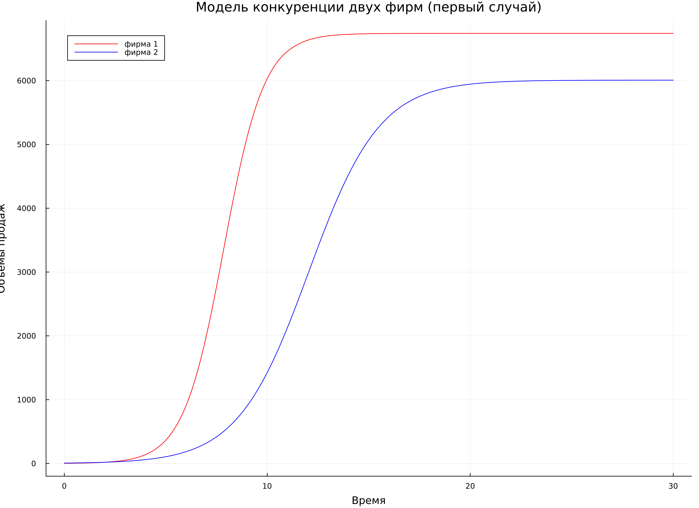
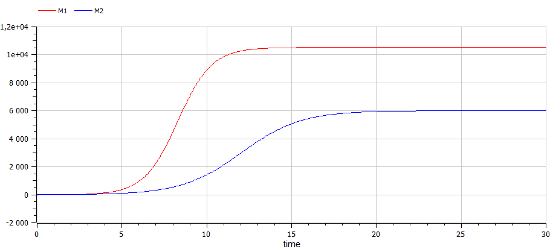
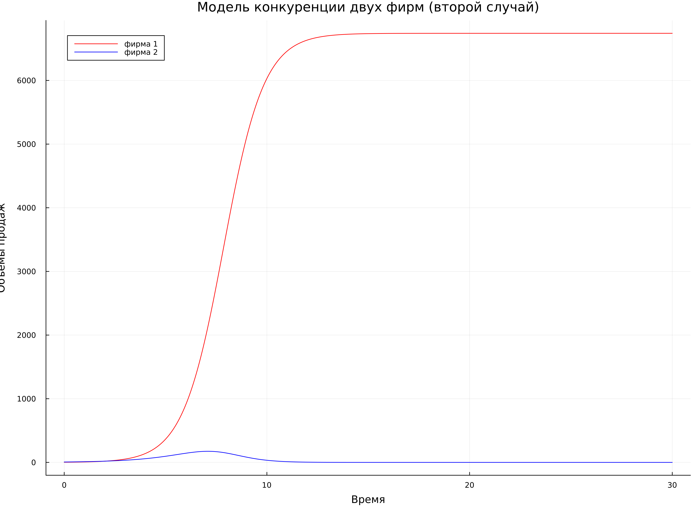
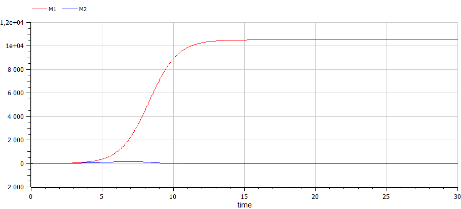

---
## Front matter
title: "Отчёт по лабораторной работе №8"
subtitle: "Дисциплина: Математическое моделирование"
author: "Выполнил: Танрибергенов Эльдар"

## Generic options
lang: ru-RU
toc-title: "Содержание"

## Bibliography
bibliography: ../bib/cite.bib
csl: ../pandoc/csl/gost-r-7-0-5-2008-numeric.csl

## Pdf output format
toc: true # Table of contents
toc-depth: 2
lof: true # List of figures
lot: true # List of tables
fontsize: 12pt
linestretch: 1.5
papersize: a4
documentclass: scrreprt
## I18n polyglossia
polyglossia-lang:
  name: russian
  options:
	- spelling=modern
	- babelshorthands=true
polyglossia-otherlangs:
  name: english
## I18n babel
babel-lang: russian
babel-otherlangs: english
## Fonts
mainfont: PT Serif
romanfont: PT Serif
sansfont: PT Sans
monofont: PT Mono
mainfontoptions: Ligatures=TeX
romanfontoptions: Ligatures=TeX
sansfontoptions: Ligatures=TeX,Scale=MatchLowercase
monofontoptions: Scale=MatchLowercase,Scale=0.9
## Biblatex
biblatex: true
biblio-style: "gost-numeric"
biblatexoptions:
  - parentracker=true
  - backend=biber
  - hyperref=auto
  - language=auto
  - autolang=other*
  - citestyle=gost-numeric
## Pandoc-crossref LaTeX customization
figureTitle: "Рис."
tableTitle: "Таблица"
listingTitle: "Листинг"
lofTitle: "Список иллюстраций"
lotTitle: "Список таблиц"
lolTitle: "Листинги"
## Misc options
indent: true
header-includes:
  - \usepackage{indentfirst}
  - \usepackage{float} # keep figures where there are in the text
  - \floatplacement{figure}{H} # keep figures where there are in the text
---

# Цель работы

Рассмотреть модель конкуренции двух фирм. Выполнить задание согласно варианту: построить графики изменения оборотных средств фирмы 1 и фирмы 2 без
учета постоянных издержек и с веденной нормировкой для двух случаев.

# Задание

**Вариант № 45**:

**Случай 1**

Рассмотреть две фирмы, производящие взаимозаменяемые товары одинакового качества и находящиеся в одной рыночной нише. Считаем, что в рамках нашей модели конкурентная борьба ведётся только рыночными методами. То есть, конкуренты могут влиять на противника путем изменения параметров своего производства: себестоимость, время цикла, но не могут прямо вмешиваться в ситуацию на рынке («назначать» цену или влиять на потребителей каким-либо иным способом.) Будем считать, что постоянные издержки пренебрежимо малы, и в модели учитывать не будем. В этом случае динамика изменения объемов продаж фирмы 1 и фирмы 2 описывается следующей системой уравнений:

$$\frac{dM_1}{d\Theta} = M_1 - \frac{b}{c_1}M_1 M_2 - \frac{a1}{c1} M_1^2 $$

$$\frac{dM_2}{d\Theta} = \frac{c_2}{c_1} M_2 - \frac{b}{c_1} M_1 M_2 - \frac{a_2}{c_1} M_2^2$$
где 

$$a_1 = \frac{p_{cr}}{\tau_1^2 \widetilde{p}_1^2 Nq },$$
$$a_2 = \frac{p_{cr}}{\tau_2^2 \widetilde{p}_2^2 Nq },$$ 
$$b = \frac{p_{cr}}{\tau_1^2 \widetilde{p}_1^2 \tau_2^2 \widetilde{p}_2^2 Nq}$$
$$c_1 = \frac{p_{cr} - \widetilde{p}_1}{\tau_1 \widetilde{p}_1},$$
$$c_2 = \frac{p_{cr} - \widetilde{p}_2}{\tau_2 \widetilde{p}_2}.$$


Также введена нормировка $t = c_1 \Theta.$

**Случай 2**

Рассмотреть модель, когда, помимо экономического фактора влияния (изменение себестоимости, производственного цикла, использование кредита и т.п.), используются еще и социально-психологические факторы – формирование общественного предпочтения одного товара другому, не зависимо от их качества и цены. В этом случае взаимодействие двух фирм будет зависеть друг от друга, соответственно коэффициент перед $M_1 M_2$ будет отличаться. Пусть в рамках рассматриваемой модели динамика изменения объемов продаж фирмы 1 и фирмы 2 описывается следующей системой уравнений:

$$\frac{dM_1}{d\Theta} = M_1 - \frac{b}{c_1}M_1 M_2 - \frac{a1}{c1} M_1^2$$

$$\frac{dM_2}{d\Theta} = \frac{c_2}{c_1} M_2 - (\frac{b}{c_1} + 0,00026) M_1 M_2 - \frac{a_2}{c_1} M_2^2$$

Для обоих случаев рассмотреть задачу со следующими начальными условиями и параметрами:

$$M_0^1=2.6,\ M_0^2=6.2,$$
$$p_{cr}=40,\ N=43,\ q=1,$$
$$\tau_1=20,\ \tau_2=14,$$
$$\widetilde{p}_1=10.7,\ \widetilde{p}_2=19.1$$

*Замечение*: $p_{cr}$, $\widetilde{p}_2$, $N$ указаны в тысячах единиц, а значения $M_{1,2}$ указаны в млн. единиц.

*Обозначения*: 

$N$ – число потребителей производимого продукта

$τ$ – длительность производственного цикла

$p$ – рыночная цена товара

$p̃$ – себестоимость продукта, то есть переменные издержки на производство единицы
продукции

$q$ – максимальная потребность одного человека в продукте в единицу времени

$\Theta=\dfrac{t}{c_1}$ - безразмерное время

1. Постройте графики изменения оборотных средств фирмы 1 и фирмы 2 без
учета постоянных издержек и с веденной нормировкой для случая 1.

2. Постройте графики изменения оборотных средств фирмы 1 и фирмы 2 без
учета постоянных издержек и с веденной нормировкой для случая 2.

# Теоретическое введение

Математическому моделированию процессов конкуренции и сотрудничества двух фирм на различных рынках посвящено довольно много научных работ, в основном использующих аппарат теории игр и статистических решений [@key-1]. 

Среди методов конкурентной борьбы можно условно выделить
следующие группы.

1. Чисто экономические (рыночные) методы, не влияющие прямо на
конкурента, но влияющие на рыночную цену. К ним относятся: сокращение
производственного цикла, снижение себестоимости продукта. В компетенцию
фирмы входит также и качество товара. Однако, как отмечалось выше, понятие
«качества» многогранно и условно. Важно, что рыночная цена товара
устанавливается в результате баланса спроса и предложения. Влиять на неё
предприниматель может, только изменяя объем производства. (то есть,
предложение). В этом случае конкуренты непосредственно не взаимодействуют
и получают информацию друг о друге через ситуацию на рынке. Эта модель в
вербальной форме была рассмотрена Курно.

2. Финансовые методы конкуренции. Имеются в виду случаи, когда один
из партнеров «назначает» низкую цену своего товара (ниже себестоимости), и в
результате конкурент разоряется. Такой метод имеет специальное название –
демпинг. Речь идет о наводнении рынка товаром, в результате чего рыночная
цена опускается ниже уровня себестоимости товара конкурента. При этом оба
конкурента терпят убытки, и вопрос заключается в том, кто из них раньше
разорится. Ясно, что на демпинг может решиться конкурент, обладающий
запасом средств, которые он использует для дотаций своего производства в
течение большого (но не бесконечного) времени. В целом, эта акция может
иметь смысл, если в результате ее конкурент полностью вытесняется с рынка.

3. Методы, выходящие за рамки чисто экономических. Легальным
методом такого типа является реклама, о которой уже шла речь. Не меньшую
роль играет антиреклама, то есть, создание негативного отношения к товару
конкурента. Формально она запрещена, но реально всегда имеет место даже вне
зависимости от действий предпринимателя [@key-2]. 

Для построения модели конкуренции хотя бы двух фирм необходимо рассмотреть модель одной фирмы. Вначале рассмотрим модель фирмы, производящей продукт долговременного пользования, когда цена его определяется балансом спроса и предложения. Примем, что этот продукт занимает определенную нишу рынка и конкуренты в ней отсутствуют. 

Обозначим:

$N$ - число потребителей производимого продукта. 

$S$ – доходы потребителей данного продукта. Считаем, что доходы всех потребителей одинаковы. Это предположение справедливо, если речь идет об одной рыночной нише, т.е. производимый продукт ориентирован на определенный слой населения. 

$M$ – оборотные средства предприятия 

$\tau$ - длительность производственного цикла

$p$ - рыночная цена товара 

$\widetilde{p}$ - себестоимость продукта, то есть переменные издержки на производство единицы продукции

$\delta$ - доля оборотных средств, идущая на покрытие переменных издержек

$k$ - постоянные издержки, которые не зависят от количества выпускаемой продукции

$Q(S/p)$ – функция спроса, зависящая от отношения дохода $S$ к цене $p$. Она равна количеству продукта, потребляемого одним потребителем в единицу времени.

Функцию спроса товаров долговременного использования часто представляют в простейшей форме: 


где $q$ – максимальная потребность одного человека в продукте в единицу времени.
Эта функция падает с ростом цены и при $p = p_{cr}$ (критическая стоимость продукта) потребители отказываются от приобретения товара. Величина $p_{cr} = Sq/k$. Параметр $k$ – мера эластичности функции спроса по цене. Таким образом, функция спроса является пороговой (то есть, $Q(S/p) = 0$ при $p \geq p_{cr}$) и обладает свойствами насыщения.

Уравнения динамики оборотных средств можно записать в виде:

$$\frac{dM}{dt} = -\frac{M \delta}{\tau} + NQp - k = -\frac{M\delta}{\tau} + Nq(1 - \frac{p}{p_{cr}})p - k$$

Уравнение для рыночной цены $p$ представим в виде:

$$\frac{dp}{dt} = \gamma (-\frac{M\delta}{\tau \widetilde{p}} + Nq(1-\frac{p}{p_{cr}}) )$$

Первый член соответствует количеству поставляемого на рынок товара (то есть, предложению), а второй член – спросу.
Параметр $\gamma$ зависит от скорости оборота товаров на рынке. Как правило, время торгового оборота существенно меньше времени производственного цикла $\tau$. При заданном M уравнение описывает быстрое стремление цены к равновесному значению цены, которое устойчиво.

В этом случае уравнение можно заменить алгебраическим соотношением

$$-\frac{M\delta}{\tau \widetilde{p}} + Nq(1-\frac{p}{p_{cr}}) = 0$$

равновесное значение цены $p$ равно

$$p = p_{cr}(1 - \frac{M\delta}{\tau \widetilde{p} Nq})$$

Тогда уравнения динамики оборотных средств приобретает вид

$$\frac{dM}{dt} = -\frac{M \delta}{\tau}(\frac{p}{p_{cr}}-1) - M^2 ( \frac{\delta}{\tau \widetilde{p} })^2 \frac{p_{cr}}{Nq} - k$$

Это уравнение имеет два стационарных решения, соответствующих условию $dM/dt=0$

$$\widetilde{M_{1,2}} = \frac{1}{2} a \pm \sqrt{\frac{a^2}{4} - b}$$

где

$$a = Nq(1 - \frac{\widetilde{p}}{p_{cr}} \widetilde{p} \frac{\tau}{\delta}), b = kNq \frac{(\tau \widetilde{p})^2}{p_{cr}\delta ^2}$$

Получается, что при больших постоянных издержках (в случае $a^2 < 4b$) стационарных состояний нет. Это означает, что в этих условиях фирма не может функционировать стабильно, то есть, терпит банкротство. Однако, как правило, постоянные затраты малы по сравнению с переменными (то есть, $b << a^2$) и играют роль, только в случае, когда оборотные средства малы. 

При $b << a$ стационарные значения $M$ равны

$$\widetilde{M_{+}} = Nq \frac{\tau}{\delta}(1 - \frac{\widetilde{p}}{p_{cr}})\widetilde{p}, \widetilde{M_{-}} = k\widetilde{p} \frac{\tau}{\delta(p_{cr} - \widetilde{p})}$$

Первое состояние $\widetilde{M_{+}}$ устойчиво и соответствует стабильному функционированию предприятия. Второе состояние $\widetilde{M_{-}}$ неустойчиво, так, что при $M < \widetilde{M_{-}}$ оборотные средства падают ($dM/dt < 0$), то есть, фирма идет к банкротству. По смыслу $\widetilde{M_{-}}$ соответствует начальному капиталу, необходимому для входа в рынок.

В обсуждаемой модели параметр $\delta$ всюду входит в сочетании с $\tau$. Это значит, что уменьшение доли оборотных средств, вкладываемых в производство, эквивалентно удлинению производственного цикла. Поэтому мы в дальнейшем положим: $\delta = 1$, а параметр $\tau$ будем считать временем цикла, с учётом сказанного [@key-3].

# Выполнение лабораторной работы

1. Задание в лабораторной работе выполняется по вариантам. Вариант расчитывается как номер остаток от деления номера студенческого билета на число заданий + 1. Таким образом, мой вариант **45**: 1032208074 % 70 + 1.

2. Напишем код для первого случая на Julia:

```
#подключаем модули
using Plots
using DifferentialEquations

#задаем начальные условия
M1 = 2.6
M2 = 6.2
p_cr = 40
N = 43
q = 1
tau1 = 20
tau2 = 14
p1 = 10.7
p2 = 19.1

a1 = p_cr / ((tau1 ^ 2) * (p1 ^ 2) * N * q)
a2 = p_cr / ((tau2 ^ 2) * (p2 ^ 2) * N * q)
b = p_cr / ((tau1 ^ 2) * (p1 ^ 2) * (tau2 ^ 2) * (p2 ^ 2) * N * q)
c1 = (p_cr - p1) / (tau1 * p1)
c2 = (p_cr - p2) / (tau2 * p2)

#состояние системы 
u0 = [M1, M2]
#отслеживаемый промежуток времени
time = [0.0, 30.0] 

#сама система 
function F!(du, u, p, t)
	du[1] = u[1] - (b / c1) * u[1] * u[2] - (a1 / c1) * (u[1] ^ 2)
	du[2] = (c2 / c1) * u[2] - (b / c1) * u[1] * u[2] - (a2 / c1) * (u[2] ^ 2)
end

prob = ODEProblem(F!, u0, time)
sol = solve(prob, saveat=0.0001)

const M_1 = Float64[]
const M_2 = Float64[]

for u in sol.u
	m1 = u[1]
	m2 = u[2]
	push!(M_1,m1)
	push!(M_2,m2)
end
 
#постреоние графиков 
plt1 = plot( dpi = 300, size = (1100,800), title ="Модель конкуренции двух фирм (первый случай)")

plot!( plt1, sol.t, M_1, color =:red, xlabel="Время", ylabel="Объемы продаж", label ="фирма 1")

plot!( plt1, sol.t, M_2, color =:blue, xlabel="Время", ylabel="Объемы продаж", label ="фирма 2")

savefig(plt1, "Jl_case1.png")

```

3. Видим результат, полученный для первого случая с помощью Julia (рис. @fig:001)

{#fig:001 width=70%}

4. Напишем код для первого случая на OpenModelica:

```
model lab81
 constant Real N = 43;
 constant Real p_cr = 40;
 constant Real q = 1;
 constant Real tau1 = 20;
 constant Real tau2 = 14;
 constant Real p1 = 10.7;
 constant Real p2 = 19.1;
 
 constant Real a1 = p_cr / ((tau1 * tau1) * (p1 * p1) * N * q);
 constant Real a2 = p_cr / ((tau2 * tau2) * (p2 * p2) * N * q);
 constant Real b = p_cr / ((tau1 * tau1) * (p1 * p1) * (tau2 * tau2) * (p2 * p2) * N * q);
 constant Real c1 = (p_cr - p1) / (tau1 * p1);
 constant Real c2 = (p_cr - p2) / (tau2 * p2);

 Real M1(start=2.6);
 Real M2(start=6.2);

equation
  der(M1) = M1 - (b / c1) * M1 * M2 - (a2 / c1) * (M1 * M1);
  der(M2) = (c2 / c1) * M2 - (b / c1) * M1 * M2 - (a2 / c1) * (M2 * M2);

  
end lab81;

```

5. Видим результат, полученный для первого случая с помощью OpenModelica (рис. @fig:002)

{#fig:002 width=70%}

6. Напишем код для второго случая на Julia:

```
#подключаем модули
using Plots
using DifferentialEquations

#задаем начальные условия
M1 = 2.6
M2 = 6.2
p_cr = 40
N = 43
q = 1
tau1 = 20
tau2 = 14
p1 = 10.7
p2 = 19.1

a1 = p_cr / ((tau1 ^ 2) * (p1 ^ 2) * N * q)
a2 = p_cr / ((tau2 ^ 2) * (p2 ^ 2) * N * q)
b = p_cr / ((tau1 ^ 2) * (p1 ^ 2) * (tau2 ^ 2) * (p2 ^ 2) * N * q)
c1 = (p_cr - p1) / (tau1 * p1)
c2 = (p_cr - p2) / (tau2 * p2)

#состояние системы 
u0 = [M1, M2]
#отслеживаемый промежуток времени
time = [0.0, 30.0] 

#сама система 
function F!(du, u, p, t)
	du[1] = u[1] - (b / c1) * u[1] * u[2] - (a1 / c1) * (u[1] ^ 2)
	du[2] = (c2 / c1) * u[2] - ((b / c1)+0.00026) * u[1] * u[2] - (a2 / c1) * (u[2] ^ 2)
end

prob = ODEProblem(F!, u0, time)
sol = solve(prob, saveat=0.0001)

const M_1 = Float64[]
const M_2 = Float64[]

for u in sol.u
	m1 = u[1]
	m2 = u[2]
	push!(M_1,m1)
	push!(M_2,m2)
end
 
#постреоние графиков 
plt1 = plot( dpi = 300, size = (1100,800), title ="Модель конкуренции двух фирм (второй случай)")

plot!( plt1, sol.t, M_1, color =:red, xlabel="Время", ylabel="Объемы продаж", label ="фирма 1")

plot!( plt1, sol.t, M_2, color =:blue, xlabel="Время", ylabel="Объемы продаж", label ="фирма 2")

savefig(plt1, "Jl_case2.png")

```

7. Видим результат, полученный для второго случая с помощью Julia (рис. @fig:003). 

{#fig:003 width=70%}

8. Напишем код для второго случая на OpenModelica:

```
model lab82
constant Real N = 43;
 constant Real p_cr = 40;
 constant Real q = 1;
 constant Real tau1 = 20;
 constant Real tau2 = 14;
 constant Real p1 = 10.7;
 constant Real p2 = 19.1;
 
 constant Real a1 = p_cr / ((tau1 * tau1) * (p1 * p1) * N * q);
 constant Real a2 = p_cr / ((tau2 * tau2) * (p2 * p2) * N * q);
 constant Real b = p_cr / ((tau1 * tau1) * (p1 * p1) * (tau2 * tau2) * (p2 * p2) * N * q);
 constant Real c1 = (p_cr - p1) / (tau1 * p1);
 constant Real c2 = (p_cr - p2) / (tau2 * p2);

 Real M1(start=2.6);
 Real M2(start=6.2);

equation
  der(M1) = M1 - (b / c1) * M1 * M2 - (a2 / c1) * (M1 * M1);
  der(M2) = (c2 / c1) * M2 - ((b / c1)+0.00026) * M1 * M2 - (a2 / c1) * (M2 * M2);
  
end lab82;

```

9. Видим результат, полученный для второго случая с помощью OpenModelica (рис. @fig:004). 

{#fig:004 width=70%}

# Выводы

Я рассмотрел модель конкуренции двух фирм. Выполнил задание согласно варианту: построил графики изменения оборотных средств фирмы 1 и фирмы 2 без
учёта постоянных издержек и с введённой нормировкой для двух случаев.

# Список литературы{.unnumbered}

::: {#refs}
:::
